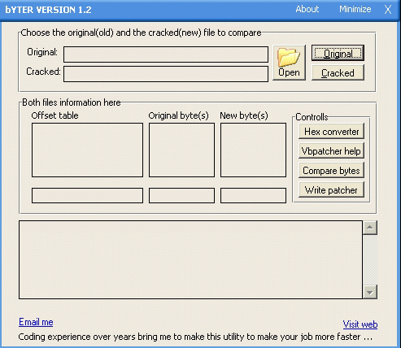



## bYTER v 1\.2

### Description

Hi guys:D after long period of not posting codes iwas a little buzy of aother things, so here iam again and may be many of you see the bYTER on Astalavista or Anticrack.de well the first version and the second soley belong to me, so after many requests of emails i decide to put the source and dedicate it to all of my brothers and sisters here so that many of them will have a look:)

What is bYTER:

----

bYTER is an engine that will compare the original and the cracked file and generate a nice vb source code so that you can copy and paste it directly to your vb IDE the first version was bugged and rubbish for that reason i didnt post it, but this i have made many of new functions as well as fixed many bugs, so take a look and please read the help buit in with the program ...

Who can use this:

----

I will say and say again the tool and the source code is for free to all, but may the reverse engineering interested people will use it more ...

Note

----

I use a nice moduly from a friend in PSCODE greetz to him :D nice one

WARN:

----

I am not responsible in any kind or any way for any patcher generated with this tool as well as i wont be bothered from any company or developer ...

THE TOOLS IS FOR FREE TEST AND EDUCATION ONLY PLEASE ...
 
### More Info
 
Just Test is :D

             |
---                |---
**Submitted On**   |2003-03-28 04:30:24
**By**             |[kegham](https://github.com/Planet-Source-Code/PSCIndex/blob/master/ByAuthor/kegham.md)
**Level**          |Intermediate
**User Rating**    |4.3 (26 globes from 6 users)
**Compatibility**  |VB 5\.0, VB 6\.0
**Category**       |[Files/ File Controls/ Input/ Output](https://github.com/Planet-Source-Code/PSCIndex/blob/master/ByCategory/files-file-controls-input-output__1-3.md)
**World**          |[Visual Basic](https://github.com/Planet-Source-Code/PSCIndex/blob/master/ByWorld/visual-basic.md)
**Archive File**   |[bYTER\_v\_1\_1573284132003\.zip](https://github.com/Planet-Source-Code/kegham-byter-v-1-2__1-44726/archive/master.zip)

